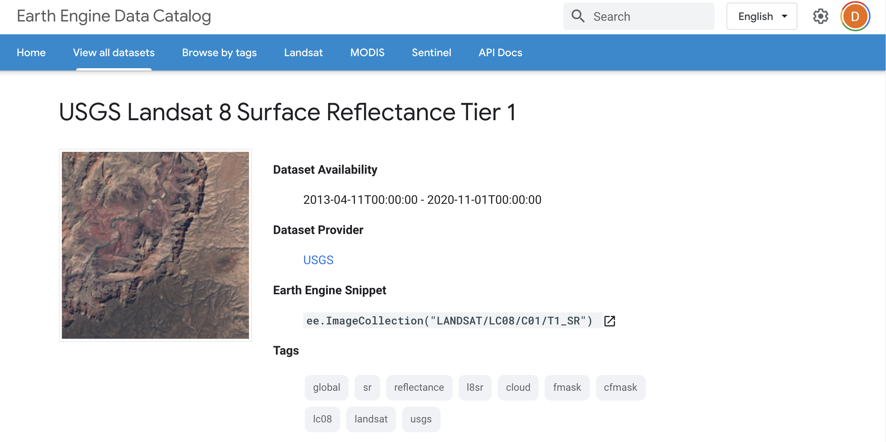
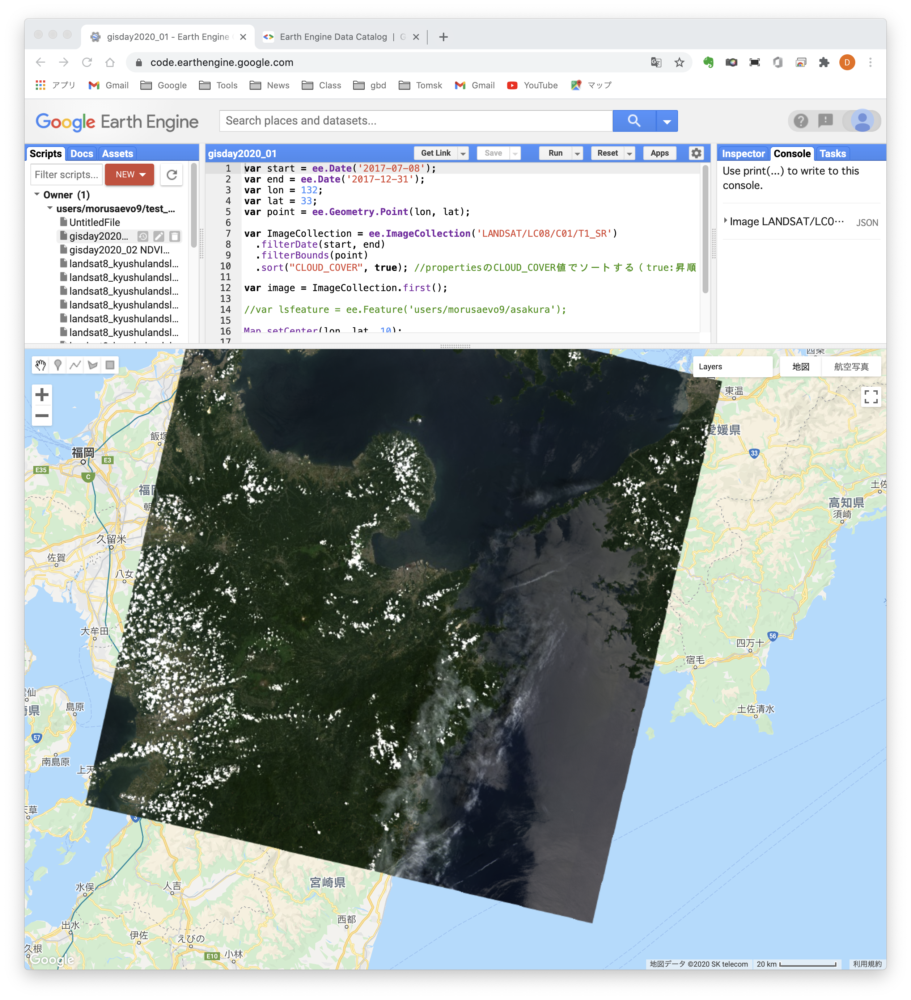

# 衛星画像の検索

## 検索の概要

GEEにおける衛星画像の検索は`ee.ImageCollection`を使って行います．引数として画像IDを指定することにより衛星画像の種類を指定できます．
IDはGEEのデータカタログで知ることができます．

## データカタログ

下の画像はGEEのデータカタログです．
GEEでは，衛星画像以外にも気象・地形・大気組成・人口分布などのデータが利用可能です．


Landsat-8を見てみましょう．
データカタログからLandsatに進みます．
Landsatは1〜8号が利用可能で，
センサーの違いを考慮しなければ1972年から現在までの画像を使うことができます．

Lanbdsat-8にはSurface Relectance（地表面反射率），Top of Atmosphere（大気上端の反射率），Raw Images（DN値）があり，
これらを用いた各種指標のコンポジットもあります．



## 衛星画像の検索

例としてLandsat-8の地表面反射率を検索してみましょう．
画像は`ee.ImageCollection`に画像IDを与えて検索します．
Landsat-8の地表面反射率のIDは`LANDSAT/LC08/C01/T1_SR`なので，以下のようになります．

```javascript
var ImageCollection = ee.ImageCollection('LANDSAT/LC08/C01/T1_SR')
```

これで，オブジェクト`ImageCollection`に検索されたすべての画像が格納されます．
場所や日付などの検索条件をつける場合はフィルタを使って絞り込みます．

`ee.Date`を使って検索の開始日と終了日を示す日付オブジェクトを作成します．
ここでは開始日を2017年1月1日，終了日を2017年12月31日とします．
`lon`と`lat`に経度と緯度を格納し，`ee.Geometry.Point`でポイントオブジェクトを作成します．

```javascript
var start = ee.Date('2017-01-01');
var end = ee.Date('2017-12-31');
var lon = 132;
var lat = 33;
var point = ee.Geometry.Point(lon, lat);
```

`filterDate`で`start`と`end`の間に取得された画像のみを抽出し，`filterBound`で`point`の座標を含む画像のみを取得します．
その後，被雲率`CLOUD_COVER`でソートします．
`true`は昇順，`false`は降順になります
`CLOUD_COVER`はLandsat-8のプロパティの一つです．
画像のプロパティはデータカタログに記載されています．

その後，`first`メソッドを使って最初の画像のみを`image`として取得します．

```javascript
var ImageCollection = ee.ImageCollection('LANDSAT/LC08/C01/T1_SR')
    .filterDate(start, end)
    .filterBounds(point)
    .sort("CLOUD_COVER", true);

var image = ImageCollection.first();
```

## 画像の表示
画像の表示は`Map`オブジェクトにレイヤーを追加することにより行います．
`setCenter`メソッドで表示する範囲の中心の座標と拡大率を指定します．
中心の座標は`(lon, lat)`，拡大率は10にしました．

次に`addLayer`を使ってレイヤーを追加します．
第1引数は表示したいImage型オブジェクト，第2引数は表示プロパティ，
第3プロパティはレイヤ名です．
表示プロパティはディクショナリで指定します．
`bands`は表示するバンド，`min`と`max`はバンドの最大値と最小値です．
バンドはRGBの並びをリストで指定しますが，
バンドの名称は使用する衛星画像によって異なるため注意が必要です．
Landsat-8の場合，B4は可視の赤，B3は可視の緑，B2は可視の青になります．
バンドの名称はデータカタログを参照してください．

以下の例ではLandst-8の画像をトゥルーカラーで表示します．
最後の`print(image)`はimageオブジェクトの属性をコンソールに表示します．

```javascript
Map.setCenter(lon, lat, 10);
Map.addLayer(image, {bands: ['B4', 'B3', 'B2'], min: 0, max: 3000, gamma: 1.5}, 'Landsat');
print(image);
```

下の例のように表示プロパティは別のオブジェクトにしても構いません．

```javascript
var visparam = {
  bands: ['B4', 'B3', 'B2'],
  min: 0,
  max: 3000,
  gamma: 1.5
};
Map.setCenter(lon, lat, 10);
Map.addLayer(image, visparam, 'Landsat');
print(image);
```

## 完成版プログラム
以下が本章の完成版プログラムです．

```javascript
var start = ee.Date('2017-01-01');
var end = ee.Date('2017-12-31');
var lon = 132;
var lat = 33;
var point = ee.Geometry.Point(lon, lat);

var ImageCollection = ee.ImageCollection('LANDSAT/LC08/C01/T1_SR')
    .filterDate(start, end)
    .filterBounds(point)
    .sort("CLOUD_COVER", true); //propertiesのCLOUD_COVER値でソートする（true:昇順、false:降順）

var image = ImageCollection.first();

var visparam = {
  bands: ['B4', 'B3', 'B2'],
  min: 0,
  max: 3000,
  gamma: 1.5
};

Map.setCenter(lon, lat, 10);
Map.addLayer(image, visparam, 'Landsat');

print(image);
```


