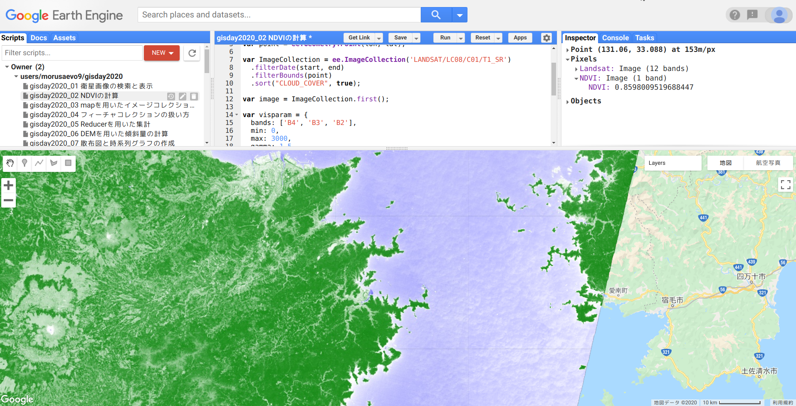

# NDVIの計算
<!-- TOC depthFrom:1 depthTo:6 withLinks:1 updateOnSave:1 orderedList:0 -->

- [NDVIの計算](#ndviの計算)
	- [NDVIの定義](#ndviの定義)
	- [バンドの取り出しと比演算](#バンドの取り出しと比演算)
	- [計算結果の表示](#計算結果の表示)
	- [プログラム全体](#プログラム全体)

<!-- /TOC -->
## NDVIの定義

植物は光合成が活発で活性度が強いほど赤の波長の光を吸収するため反射強度が小さくなります．
一方，近赤外の波長は活性度に関係なく反射強度が大きいため，
植物の活性度が強いほど近赤外の反射強度と赤の反射強度の差が大きくなります．
この原理を応用し，太陽光度や入射エネルギーが異なる画像でも植生の活性度が比較できるようにしたものが正規化植生指標（Normalized Difference Vegetation Index; NDVI）です．

NDVIの計算式は以下になります．


ここで，Redは赤の波長の反射率，NIRは近赤外の波長の反射率です．
Lansast-8では，バンド4（B4）が赤の反射率，バンド5（B5）が近赤外の反射率です．

## バンドの取り出しと比演算

`image`に対して`select`を使ってバンド4とバンド5を取り出します．
取り出したバンドはそれぞれ`red`（赤バンド）と`nir`（近赤外バンド）とします．

```javascript
var red = image.select('B4');
var nir = image.select('B5');
```

次に赤バンドと近赤外バンドの比演算を行います．
`nir`（近赤外バンド）から`subtract`メソッドを使って`red`（赤バンド）の値を引きます．
更に`nir`（近赤外バンド）と`red`（赤バンド）の和`add`で割り`divide`，
結果を`ndvi`に代入します．

```javascript
var ndvi = nir.subtract(red)
  .divide(nir.add(red))
  .rename('NDVI');
```

もしくはオブジェクト`image`に`noralizedDfference`を適用して比演算を直接行うこともできます．
以下のスクリプトはオブジェクト`image`の近赤外バンド（`B5`）と赤バンド（`B4`）の比演算の結果を`ndvi`に代入するものであり，上のスクリプトと同じ結果になります．

```javascript
var ndvi = image.normalizedDifference(['B5', 'B4']).rename('NDVI');
```

確認のためオブジェクト`ndvi`をコンソールに出力し，バンド`NDVI`が計算されているか確認します．

コンソールにはオブジェクトがJSON形式で出力されるので，
各要素を展開して値を確認することができます．
オブジェクト`ndvi`には1個のバンドがあり，バンド名は`NDVI`です．
バンド`NDVI`の値の範囲は-1から1を取ることがわかります．

``` javascript
print(ndvi);
```

## 計算結果の表示

最後に求まった`ndvi`を表示します．
ndviの表示プロパティとして`ndviparam`を設定します．
NDVIは理論的には-1から1の間の値を取ります．`max`と`min`にそれぞれ-1と1を設定します．

次に`Map.addLayer`を使って表示します．

```javascript
var ndviparam = {
  min: -1,
  max: 1,
  palette: ['blue', 'white', 'green']
  };

Map.addLayer(ndvi, ndviparam, 'NDVI');
```

## インスペクタを使った計算結果の確認

インスペクタを使えば画像上のクリックした点の値を見ることができます．
右上のペインでInspectorタブをクリックするとマウスカーソルの形が変わります．
この状態で画像上をクリックすると，その点の各レイヤーにおける値が表示されます．



## プログラム全体
```javascript
// 2. NDVIの計算

var start = ee.Date('2017-01-01');
var end = ee.Date('2017-12-31');
var lon = 132;
var lat = 33;
var point = ee.Geometry.Point(lon, lat);

var ImageCollection = ee.ImageCollection('LANDSAT/LC08/C01/T1_SR')
  .filterDate(start, end)
  .filterBounds(point)
  .sort("CLOUD_COVER", true);

var image = ImageCollection.first();

var visparam = {
  bands: ['B4', 'B3', 'B2'],
  min: 0,
  max: 3000,
  gamma: 1.5
};

Map.setCenter(lon, lat, 10);
Map.addLayer(image, visparam, 'Landsat');

var ndvi = image.normalizedDifference(['B5', 'B4']).rename('NDVI');

print(image);

var ndviparam = {
  min: -1,
  max: 1,
  palette: ['blue', 'white', 'green']
  };

Map.addLayer(ndvi, ndviparam, 'NDVI');
```
