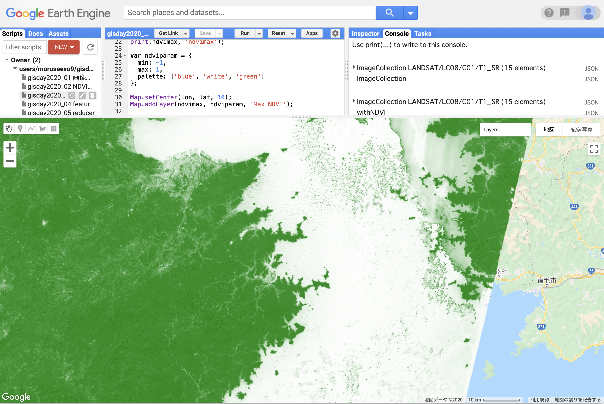

# mapを用いたイメージコレクションの処理
<!-- TOC depthFrom:1 depthTo:6 withLinks:1 updateOnSave:1 orderedList:0 -->

- [mapを用いたイメージコレクションの処理](#mapを用いたイメージコレクションの処理)
	- [mapの概念](#mapの概念)
	- [mapの手順](#mapの手順)
	- [NDVIの最大値を求める](#NDVIの最大値を求める)
	- [プログラム全体](#プログラム全体)

<!-- /TOC -->
## mapの概念

単一の画像でNDVIを求めることができました．
次は複数の画像に対してNDVIを計算してみます．

通常のプログラミングの感覚だとループを使って複数画像でNDVIを計算したいところですが，Google Earth Engineでは推奨されない方法です．
Google Earth Engineは高度に並列化されたバックグラウンドプロセッシング（おそらくMapReduce）を実現しているため，ループによる処理では並列化の恩恵を受けることができないからです．
このため，mapという概念（「地図」とは関係ありません）を使って複数画像に対する演算を行います．

このプログラムでは，検索した衛星画像のすべてにおいてNDVIを計算し，最大値のコンポジットを作成します．

## mapの手順
mapの手順は以下になります．

1. イメージコレクションを作成し，複数画像をストアする．
2. 処理用の関数を作成する．
3. mapを使ってイメージコレクションに関数を適用し画像の処理を行う．

まず，イメージコレクションを作成します．

画像の撮影日と位置は以下とします．

```javascript
var start = ee.Date('2017-01-01');
var end = ee.Date('2017-12-31');
var lon = 132;
var lat = 33;
var point = ee.Geometry.Point(lon, lat);
```
`start`から`end`の日付の間の画像を検索して`ImageCollection`に代入します．
`sort("SENSING_TIME", true)`を使って撮影日順に並び替えます（並び替えは必須ではありません．気分の問題です）．
`SENSING_TIME`は画像のプロパティの一つで，撮影日・時刻を表します．
`ImageCollection`をコンソールに出力して内容を確認します．

```javascript
var ImageCollection = ee.ImageCollection('LANDSAT/LC08/C01/T1_SR')
  .filterDate(start, end)
  .filterBounds(point)
  .sort("SENSING_TIME", true);
print(ImageCollection, 'ImageCollection');
```
次に`function`関数を使ってNDVIを計算する関数を定義します．
関数名は`addNDVI`，引数は単一の画像オブジェクトで`image`とします．
引数`image`に`normalizedDifference`を使ってNDVIの計算を行い，
`rename` を使って計算結果のバンド名を`NDVI`にします．
`image`に`addBands`でバンド`ndvi`を加えたものが関数の戻り値になります．

```javascript
var addNDVI = function(image) {
  var ndvi = image.normalizedDifference(['B5', 'B4']).rename('NDVI');
  return image.addBands(ndvi);
};
```

最後にmapを使って`ImageCollection`の一括処理を行います．
処理後（NDVIを加えた）イメージコレクションを`withNDVI`とします．
`withNDVI`をコンソールに出力し，すべての画像にNDVIが加わっているか確認してみましょう．

```javascript
var withNDVI = ImageCollection.map(addNDVI);
print(withNDVI, 'withNDVI');
```

## NDVIの最大値を求める

今のところ，イメージコレクションのすべての画像を表示する手立てはありません．
NDVIを1枚だけ表示しても面白くないので，NDVI最大値のコンポジットを作ってみましょう．

衛星画像には雲が含まれていることがあります．
雲はNDVIが低くなるので植生リモートセンシングにとってはノイズになります．
このため，ある期間におけるピクセルごとのNDVIの最大値を求めることにより，
雲の影響を取り除いたNDVIを求めることができます．

```javascript
var ndvimax = withNDVI.select('NDVI').max();
print(ndvimax);
```

NDVI計算済みのイメージコレクションである`withNDVI`に`select`メソッドを使って
各ピクセルのバンド`NDVI`の最大値を取り出します．
これを`ndvimax`とします．
`ndvimax`は1バンドのみの画像になります．
`ndvimax`もコンソールに出力して内容を確認します．

最後に'ndvimax'を画面出力します．

```javascript
var ndviparam = {
  min: -1,
  max: 1,
  palette: ['blue', 'white', 'green']
};

Map.setCenter(lon, lat, 10);
Map.addLayer(ndvimax, ndviparam, 'Max NDVI');
```


## プログラム全体
```javascript
var start = ee.Date('2017-01-01');
var end = ee.Date('2017-12-31');
var lon = 132;
var lat = 33;
var point = ee.Geometry.Point(lon, lat);

var ImageCollection = ee.ImageCollection('LANDSAT/LC08/C01/T1_SR')
  .filterDate(start, end)
  .filterBounds(point)
  .sort("SENSING_TIME", true);

print(ImageCollection, `ImageCollection`);

var addNDVI = function(image) {
  var ndvi = image.normalizedDifference(['B5', 'B4']).rename('NDVI');
  return image.addBands(ndvi);
};

var withNDVI = ImageCollection.map(addNDVI);
print(withNDVI, `withNDVI`);

var ndvimax = withNDVI.select('NDVI').max();
print(ndvimax, 'ndvimax');

var ndviparam = {
  min: -1,
  max: 1,
  palette: ['blue', 'white', 'green']
};

Map.setCenter(lon, lat, 10);
Map.addLayer(ndvimax, ndviparam, 'Max NDVI');
```
