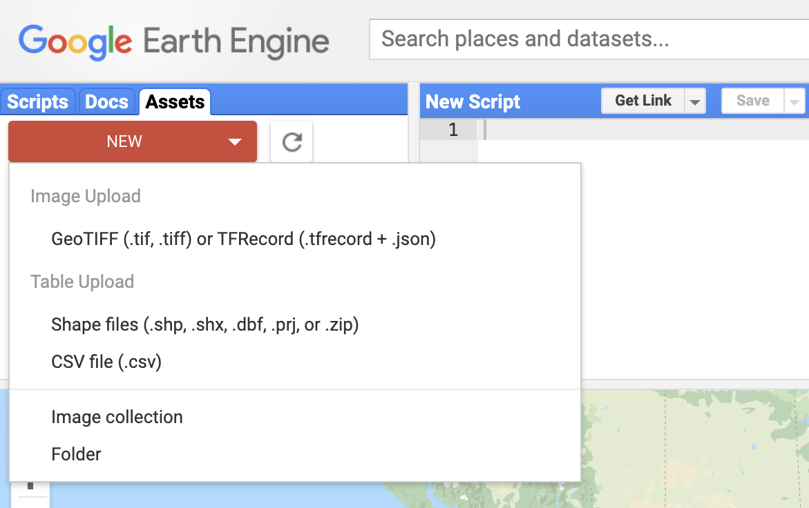
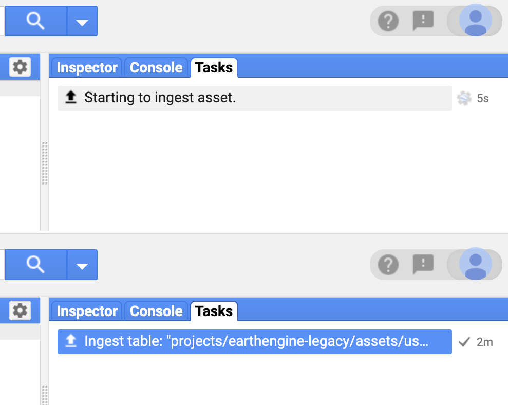
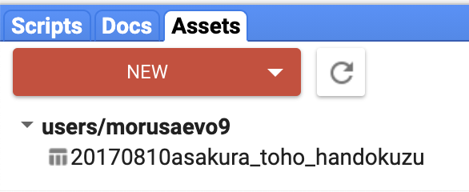
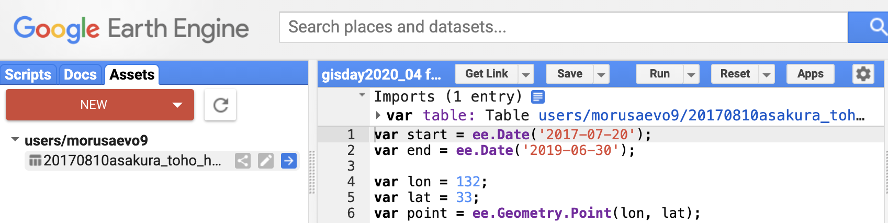

# FeatureCollectionの扱い方
<!-- TOC depthFrom:1 depthTo:6 withLinks:1 updateOnSave:1 orderedList:0 -->

- [Feature Collectionの扱い方](#FeatureCollectionの扱い方)
	- [Feature Collectionとは](#FeatureCollectionとは)
	- [ベクタ型データの準備](#ベクタ型データの準備)
	- [アセットへのアップロード](#アセットへのアップロード)
	- [アセットからスクリプトにデータをインポートする](#アセットからスクリプトにデータをインポートする)
	- [Feature Collectionからデータを選択抽出する](#FeatureCollectionからデータを選択抽出する)
	- [Feature Collectionの表示](#FeatureCollectionの表示)
	- [プログラム全体](#プログラム全体)

<!-- /TOC -->


## FeatureCollectionとは
Google Earth Engine（以下GEEと表記）では，衛星画像に代表されるラスタ型のデータ以外にベクタ型のデータも扱うことができます．
GEEではベクタ型のデータのことをFeatureと呼びます．
単体のFeatureは一つのベクタ型のデータのことを表し，複数のベクタ型データのことをFeature Collectionと呼びます．

多くのGISでは一つのベクタ型データには同じジオメトリ（ポイントならポイントだけ，ラインならラインだけ，ポリゴンならポリゴンだけ）しか格納できませんが，Feature Collectionには複数の種類のジオメトリを格納することができます．

ここでは．シンプルに単一のジオメトリからなるFeature Collectionを考えます．
例として国土地理院のホームページで公開されている平成29年7月九州北部豪雨で発生した土砂災害域のポリゴンデータをGEEに読み込んでみましょう．

GEEへのベクタ型データのインポートは以下の手順になります．

1. ベクタ型データ（zip圧縮したシェープファイル）を用意する
2. GEEのアセットにデータをアップロードする
3. アセットからスクリプトにデータをインポートする
4. 必要に応じてスクリプトにインポートコードを埋め込む

## ベクタ型データの準備
国土地理院の「平成29年７月九州北部豪雨に関する情報
」（[https://www.gsi.go.jp/BOUSAI/H29hukuoka_ooita-heavyrain.html](https://www.gsi.go.jp/BOUSAI/H29hukuoka_ooita-heavyrain.html)）から，
正射画像判読図（朝倉・東峰地区）のGeoJSONファイル（国土地理院技術資料 D1-No.874）
（[https://www.gsi.go.jp/common/000194860.zip](https://www.gsi.go.jp/common/000194860.zip)）をダウンロードします．

アセットにはzipで固めたシェープファイルをアップロードします．
シェープファイルのうち，.shp，.dbf，.shxが必須です．
.prjがない場合には，WGS84がCRSとして設定されます．

ダウンロードしたzipファイルを解凍するとGeoJSONファイルができますが，
残念ながらGEEはGeoJSONファイルをインポートすることができないため，
QGISなどでGeoJSONをシェープファイルに変換してください．
変換したシェープファイルのうち，.shp，.dbf，.shx，.prjをzip圧縮します．
今回はあらかじめzip圧縮したものを用意しておきました（[https://github.com/bokutachi256/gisday2020/blob/main/20170810asakura_toho_handokuzu.zip](https://github.com/bokutachi256/gisday2020/blob/main/20170810asakura_toho_handokuzu.zip)）.

## アセットへのアップロード

アセットへのアップロードをしてみましょう．
Code Editorの左ペインからAssetを選び，NewからShape filesを選びます．



zipで固めたシェープァイルをドラッグアンドドロップします．
アセットIDはアセットに登録したデータにアクセスするするためのユニークIDです．
デフォルトでは`users/ユーザ名/ファイル名`になりますが，`ファイル名`の部分を変更することもできます．
オプションで文字コードなどを指定し，UPLOADボタンを押します．


アップロード状況はタスクペインで確認できます．
アップロードには数分かかりますが，アップロードが終了するとステータスがIngest tableに変わります．



これでアセットにデータがアップロードできました．



## アセットからスクリプトにデータをインポートする



アセットに登録されているデータにマウスカーソルを近づけると右矢印ボタン（Import into script）が出てきます．
このボタンを押すとスクリプトにアセットをインポートできます．
エディタペインの上部にインポートされたアセットが表示されます．
インポートしたアセットは`table`というオブジェクト名でアクセスできますが，
この状態ではアセットのインポート部分がスクリプト外にありますので，スクリプトにアセットのインポート部分を埋め込みます．

インポート部分にあるShow Generated codeアイコンをクリックするとスクリプト埋め込み用のコードが表示されるので，コピーしてスクリプトにペーストします．オブジェクト名は`landslides`に変更しました．
これでスクリプト内でアセットをインポートすることができます．

```javascript
var landslides = ee.FeatureCollection("users/morusaevo9/20170810asakura_toho_handokuzu");
```

## FeatureCollectionからデータを選択抽出する

例として使っている平成27年7月九州北部豪雨の土砂災害ポリゴンには，下図のように6種類のポリゴンが含まれています．


このうち，本プログラムでは洪水到達範囲と土砂崩壊地のポリゴンのみを使用しますので，この2種類のポリゴンのみを選択抽出します．
ポリゴンの選択抽出にはImage Collectionと同様にFeature Collectionで`filter`メソッドを使います．
土砂災害ポリゴンの`name`属性がポリゴンの種類を示しているのでこれを利用します．
`ee.Filter.inList`を用いて`name`属性に`土砂崩壊地`と`洪水流到達範囲`が含まれているポリゴンのみを抽出します．
`ee.FIlter.inList`の条件はリストで指定します．
抽出したオブジェクトをコンソールに出力して内容を確認します．

```javascript
var landslides = ee.FeatureCollection("users/morusaevo9/20170810asakura_toho_handokuzu")
  .filter(ee.Filter.inList('name', ['土砂崩壊地', '洪水流到達範囲']));
print(landslides);
```

## FeatureCollectionの表示

Feature CollectionもImage Collectionと同様に`Map.addLayer`を使って画面表示します．
属性ごとに色分けをして表示したいところですが，GEEではなかなか手間がかかるのでこのサンプルでは少し手抜きをしています．
`filter`メソッドを使って`土砂崩壊地`と`洪水到達範囲`を分け，それぞれ別の色で表示してみました．

```javascript
Map.addLayer(landslides
  .filter(ee.Filter.eq('name', '土砂崩壊地')), {color: 'orange'}, '土砂崩壊地');
Map.addLayer(landslides
  .filter(ee.Filter.eq('name', '洪水流到達範囲')), {color: 'blue'}, '洪水流到達範囲');
```

## プログラム全体

以下のプログラムでは，衛星画像の検索にパスとロウを指定しています．
これでまでのプログラムでは`ee.Geometry.Point`で作成したポイントオブジェクトを含む衛星画像を検索していましたが，ポイントオブジェクトを含む方法では画像が重なっている場合に異なる位置の画像が検索される可能性があります．
このため，Landsat-8のパスとロウを示すプロパティ`WRS_PATH`と`WRS_ROW`を用いて画像を検索しています．

```javascript
var start = ee.Date('2015-07-01');
var end = ee.Date('2017-06-30');

var lon = 132;
var lat = 33;
var point = ee.Geometry.Point(lon, lat);

var landslides = ee.FeatureCollection("users/morusaevo9/20170810asakura_toho_handokuzu")
  .filter(ee.Filter.inList('name', ['土砂崩壊地', '洪水流到達範囲']));
print(landslides);

// 豪雨前の衛星画像の取得
var ImageCollection = ee.ImageCollection('LANDSAT/LC08/C01/T1_SR')
    .filterDate(start, end)
    .filter(ee.Filter.eq('WRS_PATH', 112))
    .filter(ee.Filter.eq('WRS_ROW', 37));

// NDVI計算用の関数定義
var addNDVI = function(image) {
  var ndvi = image.normalizedDifference(['B5', 'B4']).rename('NDVI');
  return image.addBands(ndvi);
};

// 豪雨前後の画像画像コレクションにNDVIを追加
var withNDVI = ImageCollection.map(addNDVI);

var ndvimax = withNDVI.select('NDVI').max();

// マップ中心座標の設定
Map.setCenter(lon, lat, 10);

// NDVIと差分の表示パラメーターの定義
var ndviparam = {
  min: -1,
  max: 1,
  palette: ['blue', 'white', 'green']
};

Map.addLayer(ndvimax, ndviparam, 'max NDVI');
Map.addLayer(landslides
  .filter(ee.Filter.eq('name', '土砂崩壊地')), {color: 'orange'}, '土砂崩壊地');
Map.addLayer(landslides
  .filter(ee.Filter.eq('name', '洪水流到達範囲')), {color: 'blue'}, '洪水流到達範囲');

```
