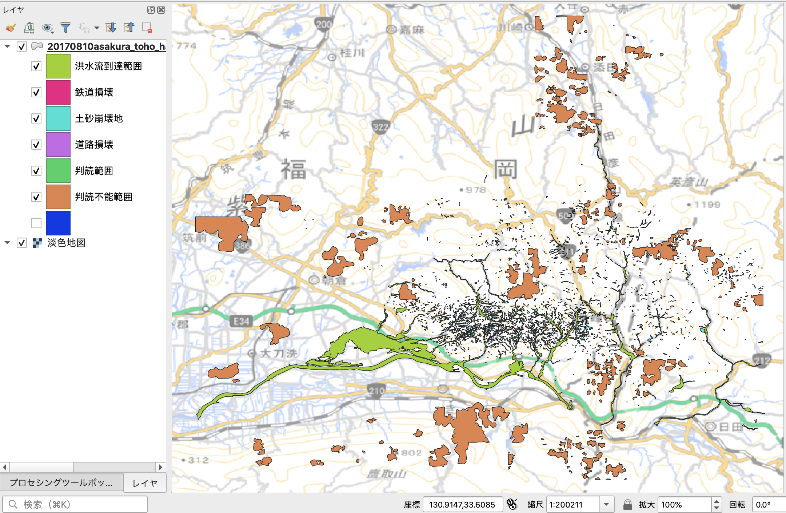

# Feature Collectionの扱い方



## Feature Collectionとは
Google Earth Engine（以下GEEと表記）では衛星画像に代表されるラスタ型のデータ以外に，ベクタ型のデータも扱うことができます．
GEEではベクタ型のデータのことをFeatureと呼びます．
単体のFeatureは一つのベクタ型のデータのことを表し，複数のベクタ型データのことをFeature Colletionと呼びます．

多くのGISでは一つのベクタ型データには同じジオメトリ（ポイントならポイントだけ，ラインならラインだけ，ポリゴンならポリゴンだけ）しか格納できませんが，FeatureCollectionには複数の種類のジオメトリを格納することができます．

ここでは．シンプルに単一のジオメトリからなるFeatureCollectionを考えます．
サンプルとして国土地理院のホームページで公開されている平成29年7月九州北部豪雨で発生した土砂災害域のポリゴンデータをGEEに読み込んでみましょう．

GEEへのベクタ型データのインポートは以下の手順になります．

1. ベクタ型データを用意する（zip圧縮したシェープファイル）
2. GEEのアセットにデータをアップロードする
3. アセットからスクリプトにデータをインポートする
4. 必要に応じてスクリプトにインポートコードを埋め込む

## ベクタ型データの準備
国土地理院の「平成29年７月九州北部豪雨に関する情報
」（[https://www.gsi.go.jp/BOUSAI/H29hukuoka_ooita-heavyrain.html](https://www.gsi.go.jp/BOUSAI/H29hukuoka_ooita-heavyrain.html)）から，
正射画像判読図（朝倉・東峰地区）のGeoJSONファイル（国土地理院技術資料 D1-No.874）
（[https://www.gsi.go.jp/common/000194860.zip](https://www.gsi.go.jp/common/000194860.zip)）をダウンロードします．

アセットにはzipで固めたシェープファイルをアップロードします．
シェープファイルのうち，.shp，.dbf，.shxが必須です．
.prjがない場合には，WGS84がCRSとして設定されます．

ダウンロードしたzipファイルを解凍するとGeoJSONファイルができますが，
残念ながらGEEはGeoJSONファイルをインポートすることができないため，
QGISなどでGeoJSONをシェープファイルに変換してください．
変換したシェープファイルのうち，.shp，.dbf，.shx，.prjをzip圧縮します．
今回はあらかじめzip圧縮したものを用意しておきました（[https://github.com/bokutachi256/gisday2020/blob/main/20170810asakura_toho_handokuzu.zip](https://github.com/bokutachi256/gisday2020/blob/main/20170810asakura_toho_handokuzu.zip)）.

## アセットへのアップロード


```javascript
var start = ee.Date('2015-07-01');
var end = ee.Date('2017-06-30');

var lon = 132;
var lat = 33;
var point = ee.Geometry.Point(lon, lat);

var landslides = ee.FeatureCollection("users/morusaevo9/20170810asakura_toho_handokuzu")
  .filter(ee.Filter.inList('name', ['土砂崩壊地', '洪水流到達範囲']));

print(landslides);

// 豪雨前の衛星画像の取得
var ImageCollection = ee.ImageCollection('LANDSAT/LC08/C01/T1_SR')
    .filterDate(start, end)
    .filter(ee.Filter.eq('WRS_PATH', 112))
    .filter(ee.Filter.eq('WRS_ROW', 37));

// NDVI計算用の関数定義
var addNDVI = function(image) {
  var ndvi = image.normalizedDifference(['B5', 'B4']).rename('NDVI');
  return image.addBands(ndvi);
};

// 豪雨前後の画像画像コレクションにNDVIを追加
var withNDVI = ImageCollection.map(addNDVI);

var ndvimax = withNDVI.select('NDVI').max();

// マップ中心座標の設定
Map.setCenter(lon, lat, 10);

// NDVIと差分の表示パラメーターの定義
var ndviparam = {
  min: -1,
  max: 1,
  palette: ['blue', 'white', 'green']
};

Map.addLayer(ndvimax, ndviparam, 'max NDVI');
Map.addLayer(landslides
  .filter(ee.Filter.eq('name', '土砂崩壊地')), {color: 'orange'}, '土砂崩壊地');
Map.addLayer(landslides
  .filter(ee.Filter.eq('name', '洪水流到達範囲')), {color: 'blue'}, '洪水流到達範囲');

```
