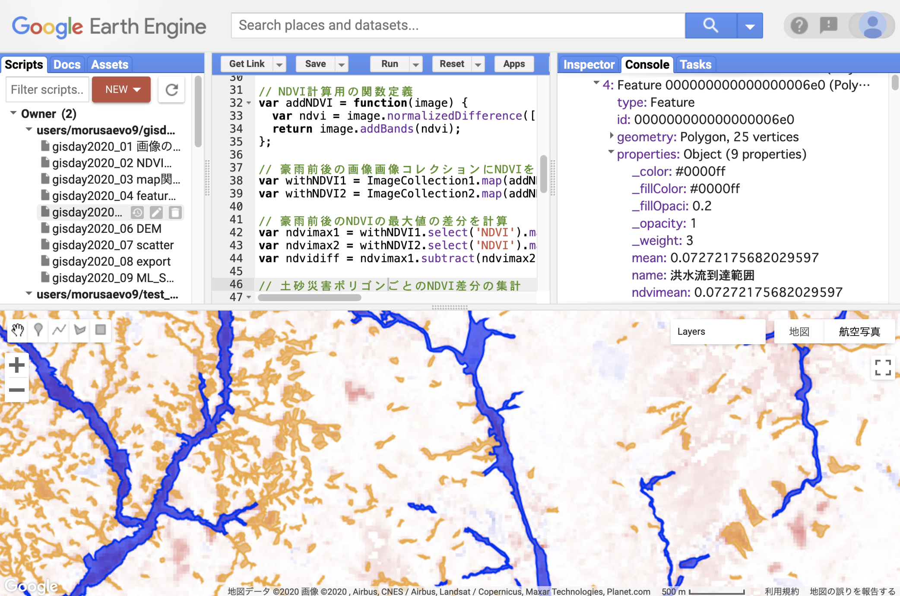

# Reducerを用いた集計
<!-- TOC depthFrom:1 depthTo:6 withLinks:1 updateOnSave:1 orderedList:0 -->

- [Reducerを用いた集計](#Reducerを用いた集計)
	- [Reducerの概念](#Reducerの概念)
	- [Reducerの手順](#Reducerの手順)
	- [集計される側のイメージコレクションを用意する](#集計される側のイメージコレクションを用意する)
	- [集計単位となるフィーチャコレクションを用意する](#集計単位となるフィーチャコレクションを用意する)
	- [Reducerを用いて集計する](#Reducerを用いて集計する)
	- [プログラム全体](#プログラム全体)

<!-- /TOC -->

## Reducerの概念
ReducerはGEEの強力な機能の一つです．
Reducerを使うと膨大な量のデータに対して，空間・時間・バンドなどを単位とした集計が可能になります．
ここでは，例として平成29年7月九州北部豪雨によって生じた土砂災害ポリゴンごとに，豪雨前後のNDVIがどのくらい変化をしているのか集計します．

## Reducerの手順

Reducerの手順は以下になります．

1. 集計される側のイメージコレクションを用意する
2. 集計単位のフィーチャコレクションを用意する
2. Reducerを用いて集計する

## 集計される側のイメージコレクションを用意する

集計される側のイメージコレクションとして，豪雨前後のNDVIの最大値の差を求めましょう．
土砂災害が発生した場所は植生が剥ぎ取られるため，豪雨後は豪雨前よりもNDVIが低下すると考えられます．すなわち，豪雨前のNDVIから豪雨後のNDVIを引いた差が大きい場所は土砂災害が発生した場所と考えられます．

まず豪雨前後のNDVIの最大値を求めましょう．
平成29年7月九州北部豪雨は2017年7月5日から6日にかけて起きました．
この日付を境として前後1年ずつのイメージコレクションを作成します．
`start1`と`end1`は豪雨前の開始日と終了日，
`start2`と`end2`を豪雨後の開始日と終了日とします．
豪雨前と豪雨後の期間はそれぞれ約1年としました．

```javascript
var start1 = ee.Date('2016-07-01');
var end1 = ee.Date('2017-07-04');

var start2 = ee.Date('2017-07-07');
var end2 = ee.Date('2018-07-04');

var lon = 132;
var lat = 33;
var point = ee.Geometry.Point(lon, lat);
```

次に豪雨前と豪雨後のイメージコレクションを作成します．
豪雨前を`Imagecollection1`，豪雨後を`ImageCollection2`としています．
パスとロウを指定して同じ位置の画像に限定します．

```javascript
var ImageCollection1 = ee.ImageCollection('LANDSAT/LC08/C01/T1_SR')
    .filterDate(start1, end1)
    .filter(ee.Filter.eq('WRS_PATH', 112))
    .filter(ee.Filter.eq('WRS_ROW', 37));

var ImageCollection2 = ee.ImageCollection('LANDSAT/LC08/C01/T1_SR')
    .filterDate(start2, end2)
    .filter(ee.Filter.eq('WRS_PATH', 112))
    .filter(ee.Filter.eq('WRS_ROW', 37));
```

比演算を用いて豪雨前後のイメージコレクションのNDVIを計算します．
豪雨前後のNDVI計算済みのイメージコレクションはそれぞれ
`withNDVI1`と`withNDVI2`にしました．

```javascript
var addNDVI = function(image) {
  var ndvi = image.normalizedDifference(['B5', 'B4']).rename('NDVI');
  return image.addBands(ndvi);
};

var withNDVI1 = ImageCollection1.map(addNDVI);
var withNDVI2 = ImageCollection2.map(addNDVI);
```

さらに豪雨前後のNDVIの最大値を求めます．
それぞれ`ndvimax1`と`ndvimax2`にしました．

```javascript
var ndvimax1 = withNDVI1.select('NDVI').max();
var ndvimax2 = withNDVI2.select('NDVI').max();
```

次に豪雨前後のNDVIの最大値の差を取ります．
差が大きいところは豪雨を挟んでNDVIが低下した場所になります．

`ndvimax1`（豪雨前のNDVIの最大値）から`subtract`メソッドを使って`ndvimax2`（豪雨後のNDVIの最大値）を引き，
それを`ndvidiff`オブジェクトに格納します．

```javascript
var ndvidiff = ndvimax1.subtract(ndvimax2);
```

## 集計単位となるフィーチャコレクションを用意する

次に集計単位となるフィーチャコレクションを用意します．

アセットから土砂災害ポリゴンを読み込んで`土砂崩壊地`と`洪水流到達範囲`のみを取りだし，
`landslide`オブジェクトとします．
念のためコンソールに表示します．

```javascript
var landslides = ee.FeatureCollection("users/morusaevo9/20170810asakura_toho_handokuzu")
  .filter(ee.Filter.inList('name', ['土砂崩壊地', '洪水流到達範囲']));
print(landslides);
```

## Reducerを用いて集計する

Reducerを使ってポリゴンごとにNDVIの差の平均を集計しましょう．
豪雨前後のNDVIの最大値の差`ndvidiff`に対して`reduceRegions`メソッドを使います．
`reduceRegions`メソッドの引数は`collection`，`reducer`，`scale`の3個です．
`coollection`は集計単位となるフィーチャコレクション（この場合は`landslides`），
`reducer`は集計方法（今回は平均値`ee.Reducer.mean`とします），
`scale`は集計のスケール（今回はLandsat-8の1ピクセルの大きさに合わせて`30`メートルにしました）です．
以上の設定で集計を行い，集計結果を`landslides`オブジェクトに格納します．

```javascript
var landslides = ndvidiff.reduceRegions({
  collection: landslides,
  reducer: ee.Reducer.mean(),
  scale: 30,
});
```

reducerの集計結果は`landslides`オブジェクトの中に格納されますが，
属性名は`mean`になります．
これでは何の平均なのかわからないので属性名を変更したいのですが，
GEEでは属性名を変更する方法がない（見つからない）ので，
わかりやすい名前の属性を新たに作り値をコピーします．

具体的には属性`ndvimean`を作って`mean`の値をコピーします．
`landslides`に含まれるすべてのポリゴンに対してこの操作を行うため，
`map`を使って一括で処理を行います．

mapする関数は以下になります．
単一のフィーチャである`feature`を引数として`get`メソッドで属性`mean`の値を取得し，
それを属性`ndvimean`の値とします．
関数の戻り値は`ndvimean`に`mean`の値をセットしたフィーチャです．

```javascript
function(feature){
  return feature.set({ndvimean: feature.get('mean')});
}
```

上記の関数をフィーチャコレクションに対して`map`すると以下になります．
これでフィーチャコレクション`landslides`の各ポリゴンに属性`ndvimean`が追加されます（属性`mean`も残っています）．

```javascript
var landslides = landslides.map(function(feature){
  return feature.set({ndvimean: feature.get('mean')});
});
```

集計したフィーチャコレクション`landslides`をコンソールに出力して確かめてみましょう

```javascript
print('landslides', landslides);
```

あとは必要なデータを地図表示してください．




## プログラム全体

```javascript
// 5. Reducerを用いた集計

var start1 = ee.Date('2016-07-01');
var end1 = ee.Date('2017-07-04');

var start2 = ee.Date('2017-07-07');
var end2 = ee.Date('2018-07-04');

var lon = 132;
var lat = 33;
var point = ee.Geometry.Point(lon, lat);

var ImageCollection1 = ee.ImageCollection('LANDSAT/LC08/C01/T1_SR')
    .filterDate(start1, end1)
    .filter(ee.Filter.eq('WRS_PATH', 112))
    .filter(ee.Filter.eq('WRS_ROW', 37));

var ImageCollection2 = ee.ImageCollection('LANDSAT/LC08/C01/T1_SR')
    .filterDate(start2, end2)
    .filter(ee.Filter.eq('WRS_PATH', 112))
    .filter(ee.Filter.eq('WRS_ROW', 37));

var addNDVI = function(image) {
  var ndvi = image.normalizedDifference(['B5', 'B4']).rename('NDVI');
  return image.addBands(ndvi);
};

var withNDVI1 = ImageCollection1.map(addNDVI);
var withNDVI2 = ImageCollection2.map(addNDVI);

var ndvimax1 = withNDVI1.select('NDVI').max();
var ndvimax2 = withNDVI2.select('NDVI').max();
var ndvidiff = ndvimax1.subtract(ndvimax2);

var landslides = ee.FeatureCollection("users/morusaevo9/20170810asakura_toho_handokuzu")
  .filter(ee.Filter.inList('name', ['土砂崩壊地', '洪水流到達範囲']));
print(landslides);

var landslides = ndvidiff.reduceRegions({
  collection: landslides,
  reducer: ee.Reducer.mean(),
  scale: 30,
});

var landslides = landslides.map(function(feature){
  return feature.set({ndvimean: feature.get('mean')});
});

print('landslides', landslides);

Map.setCenter(lon, lat, 10);

var ndviparam = {
  min: -1,
  max: 1,
  palette: ['blue', 'white', 'green']
};

var diffparam = {
  min: -1,
  max: 1,
  palette: ['blue', 'white', 'red']
};

Map.addLayer(ndvimax1, ndviparam, 'max NDVI before landslides');
Map.addLayer(ndvimax2, ndviparam, 'max NDVI after landslides');
Map.addLayer(ndvidiff, diffparam, 'max NDVI diff');
Map.addLayer(landslides.filter(ee.Filter.eq('name', '土砂崩壊地')), {color: 'orange'}, '土砂崩壊地');
Map.addLayer(landslides.filter(ee.Filter.eq('name', '洪水流到達範囲')), {color: 'blue'}, '洪水流到達範囲');
```
