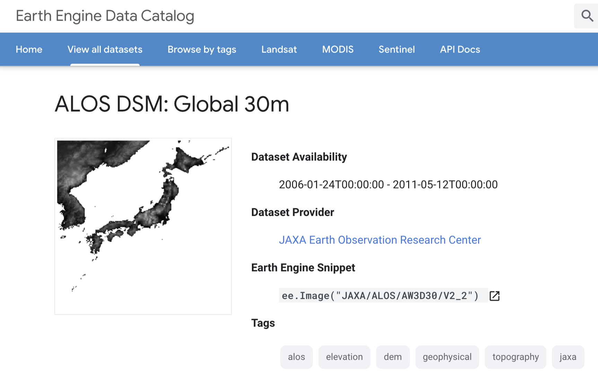
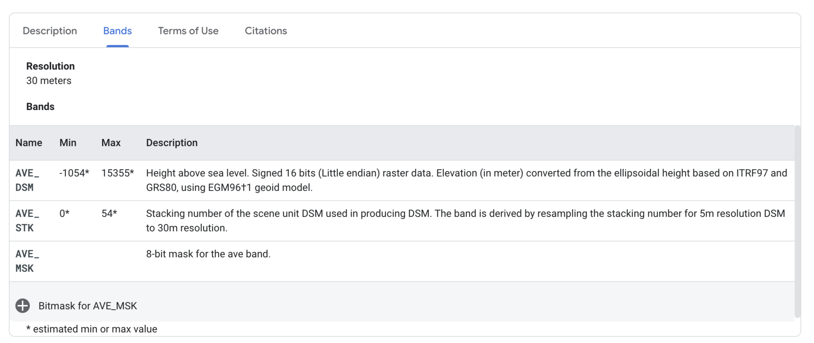
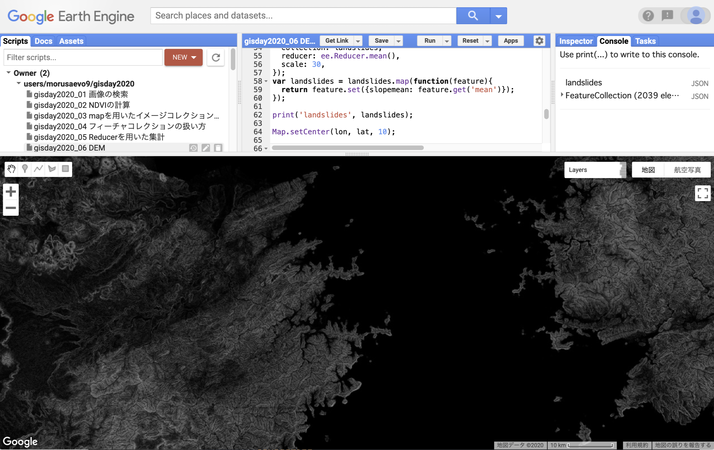

# DEMを用いた傾斜量の計算
<!-- TOC depthFrom:1 depthTo:6 withLinks:1 updateOnSave:1 orderedList:0 -->

- [DEMを用いた傾斜量の計算](#DEMを用いた傾斜量の計算)
	- [GEEにおけるDEMの利用](#GEEにおけるDEMの利用)
	- [DEMの読み込み](#DEMの読み込み)
	- [傾斜量の計算](#傾斜量の計算)
	- [土砂災害ポリゴンごとの傾斜量の平均の集計](#土砂災害ポリゴンごとの傾斜量の平均の集計)
	- [傾斜量の画面表示](#傾斜量の画面表示)
	- [プログラム全体](#プログラム全体)

<!-- /TOC -->
## GEEにおけるDEMの利用

GEEには衛星画像以外にも多数のデータが用意されています．
例えば数値標高モデル（Digigal Elevation Model; DEM）もその一つです．
GEEで利用可能なDEMはSRTMやALOS DSMなどがあり，全球データでは30m解像度程度のものになります．
また，DEM（DSM）から計算した各種二次データもあります．

ここでは，ALOS DSMを用いて傾斜量を計算し，土砂災害ポリゴンごとに平均傾斜を集計します．



## DEMの読み込み

ALOS DSMのIDは`JAXA/ALOS/AW3D30/V2_2`です．
このIDを使ってオブジェクト`aw3d30`を作成します．

```javascript
var aw3d30 = ee.Image("JAXA/ALOS/AW3D30/V2_2");
```



次にオブジェクト`aw3d30`からDSMのバンドを選択します．
データカタログから，DSMのバンド名は`AVE_DSM`です．
`aw3d30`で`select`メソッドを使って`AVE_DSM`を取りだし，オブジェクト`elevation`に格納します．

```javascript
var elevation = aw3d30.select('AVE_DSM');
```

以上でALOS DSMを使う準備ができました．

## 傾斜量の計算

次にオブジェクト`elevation`から傾斜量を計算しましょう．
GEEには各種地形量を計算するための関数が用意されています．
傾斜量は`ee.Terrain.slope`で求まります．
`ee.Terrain.slope`の引数は傾斜を求めるDEMのみです．
求まった傾斜量はオブジェクト`slope`に格納します．

```javascript
var slope = ee.Terrain.slope(elevation);
```

ここで疑問が出てくるかもしれません．
今までに行った衛星画像の処理，例えばNDVIの計算では計算範囲が一枚の衛星画像の範囲でした．
しかし今回行っているALOS DSMを使った傾斜量の計算では，傾斜量を計算する範囲を定義していません．
ALOS DSMは全球を覆っているので，もしかすると全球にわたって傾斜量を計算しているのでしょうか．

答えはNOです．GEEでは必要なときに必要な分だけ計算を行っています．
今回の例ですと，実際に傾斜量が計算されるのは次で行うReducerによる集計の時と，
画面表示の時になります．
このように，GEEでは最適化された計算を行うことで巨大なデータでも短時間で処理が可能です．


## 土砂災害ポリゴンごとの傾斜量の平均の集計

Reducerを使って土砂災害ポリゴンごとに傾斜量の平均を集計しましょう．

`slope`に対して`reduceRegions`を用いて集計を行います．
集計単位は土砂災害ポリゴンである`landslides`，
reducerは平均値を求める`ee.Reducer.mean`，
集計のスケールはALOS DSMに合わせて`30`mにします．

```javascript
var landslides = slope.reduceRegions({
  collection: landslides,
  reducer: ee.Reducer.mean(),
  scale: 30,
});
```

reducerで平均を集計すると，オブジェクト`landslides`の属性`mean`にポリゴンごとの傾斜量の平均値が格納されます．
NDVIの集計の時と同じように，属性`slopemean`を作成して平均値をコピーします．

確認のために`landslides`をコンソールに出力して確認します．

```javascript
var landslides = landslides.map(function(feature){
  return feature.set({slopemean: feature.get('mean')});
});
print('landslides', landslides);
```

## 傾斜量の画面表示

せっかく傾斜量を求めたので，画面出力もします．
衛星画像と同様に`Map.addLayer`を使います．

表示パラメーターを指定しないとグレースケールで表示されます．

```javascript
Map.addLayer(slope, {}, 'slope');
```




## プログラム全体

```javascript
//6. DEMを用いた傾斜量の計算

var start1 = ee.Date('2016-07-01');
var end1 = ee.Date('2017-07-04');

var start2 = ee.Date('2017-07-07');
var end2 = ee.Date('2018-07-04');

var lon = 132;
var lat = 33;
var point = ee.Geometry.Point(lon, lat);

var landslides = ee.FeatureCollection("users/morusaevo9/20170810asakura_toho_handokuzu")
  .filter(ee.Filter.inList('name', ['土砂崩壊地', '洪水流到達範囲']));

var ImageCollection1 = ee.ImageCollection('LANDSAT/LC08/C01/T1_SR')
    .filterDate(start1, end1)
    .filter(ee.Filter.eq('WRS_PATH', 112))
    .filter(ee.Filter.eq('WRS_ROW', 37));

var ImageCollection2 = ee.ImageCollection('LANDSAT/LC08/C01/T1_SR')
    .filterDate(start2, end2)
    .filter(ee.Filter.eq('WRS_PATH', 112))
    .filter(ee.Filter.eq('WRS_ROW', 37));

var aw3d30 = ee.Image("JAXA/ALOS/AW3D30/V2_2");
var elevation = aw3d30.select('AVE_DSM');
var slope = ee.Terrain.slope(elevation);


var addNDVI = function(image) {
  var ndvi = image.normalizedDifference(['B5', 'B4']).rename('NDVI');
  return image.addBands(ndvi);
};

var withNDVI1 = ImageCollection1.map(addNDVI);
var withNDVI2 = ImageCollection2.map(addNDVI);

var ndvimax1 = withNDVI1.select('NDVI').max();
var ndvimax2 = withNDVI2.select('NDVI').max();
var ndvidiff = ndvimax1.subtract(ndvimax2);

var landslides = ndvidiff.reduceRegions({
  collection: landslides,
  reducer: ee.Reducer.mean(),
  scale: 30,
});
var landslides = landslides.map(function(feature){
  return feature.set({ndvimean: feature.get('mean')});
});

var landslides = slope.reduceRegions({
  collection: landslides,
  reducer: ee.Reducer.mean(),
  scale: 30,
});
var landslides = landslides.map(function(feature){
  return feature.set({slopemean: feature.get('mean')});
});

print('landslides', landslides);

Map.setCenter(lon, lat, 10);

var ndviparam = {
  min: -1,
  max: 1,
  palette: ['blue', 'white', 'green']
};

var diffparam = {
  min: -1,
  max: 1,
  palette: ['blue', 'white', 'red']
};

Map.addLayer(ndvimax1, ndviparam, 'max NDVI before landslides');
Map.addLayer(ndvimax2, ndviparam, 'max NDVI after landslides');
Map.addLayer(ndvidiff, diffparam, 'max NDVI diff');
Map.addLayer(slope, {}, 'slope');
Map.addLayer(landslides.filter(ee.Filter.eq('name', '土砂崩壊地')), {color: 'orange'}, '土砂崩壊地');
Map.addLayer(landslides.filter(ee.Filter.eq('name', '洪水流到達範囲')), {color: 'blue'}, '洪水流到達範囲');
```
