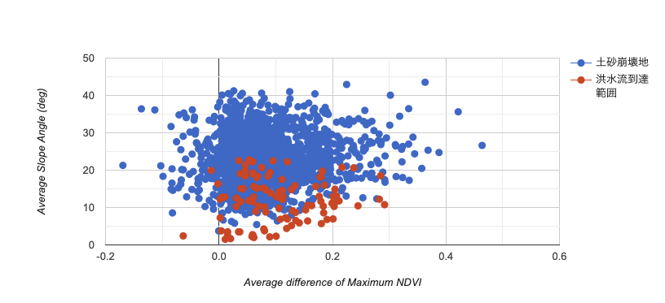
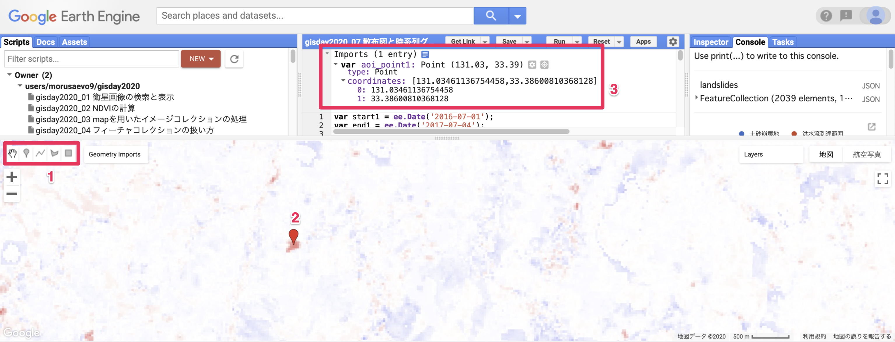
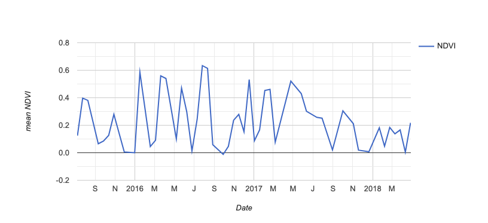

# 散布図と時系列グラフの作成

<!-- TOC depthFrom:1 depthTo:6 withLinks:1 updateOnSave:1 orderedList:0 -->

- [散布図と時系列グラフの作成](#散布図と時系列グラフの作成)
	- [チャートの概要](#チャートの概要)
	- [散布図の作成](#散布図の作成)
	- [時系列チャートの作成](#時系列チャートの作成)
	- [プログラム全体](#プログラム全体)

<!-- /TOC -->

## チャートの概要

GEEにはグラフ（チャート）作成機能があります．
例えばReducerで集計した土砂災害ポリゴンごとのNDVI差の平均と傾斜量の平均を散布図で表せば，
土砂崩壊地と洪水流到達範囲を分ける方法が見つかるかもしれません．

また，時系列グラフを作成することにより，NDVIの時間変化を把握することができます．

チャートの作成手順は以下になります．

* 散布図の場合
1. 散布図に書きたい属性をフィーチャコレクションに加える
2. チャートオブジェクトを作成する

* 時系列グラフの場合
1. 時系列グラフを作成したいイメージコレクションを作成する
2. 作成したいポイントを指定する
3. チャートオブジェクトを作成する

## 散布図の作成

前章までで作成した土砂災害ポリゴン`landslides`を使って，
ポリゴンごとに集計したNDVIの最大値の差の平均`ndvimean`と傾斜量の平均`slopemean`の散布図を作ります．
ポリゴンの属性（`土砂崩壊地`か`洪水流到達範囲`）で色分けをします．

集計はすでに終わっているので，チャートオブジェクトを作成します．
フィーチャコレクションから散布図を作成するので，
作成するチャートオブジェクトは`ui.Chart.feature.groups`になります．
第一引数は作成対象となるフィーチャコレクション（`landslides`），
第二引数は横軸の属性名（`ndvimean`），第三引数は縦軸の属性名（`slopemean`），
第四引数は系列を表す属性（`name`）になり，
`setChartType`で散布図`ScatterChart`を指定します．

さらにオプションとして縦軸のタイトル（`vAxis`）と
横軸のタイトル（`hAxis`）を指定します．

オブジェクトが作成できたらチャートオブジェクトをコンソールに出力します．

```javascript
var chart = ui.Chart.feature.groups(
    landslides, 'ndvimean', 'slopemean', 'name'
  )
  .setChartType('ScatterChart')
  .setOptions({
    vAxis: {title: 'Average Slope Angle (deg)'},
    hAxis: {title: 'Average difference of Maximum NDVI'},
  });
print(chart);
```



作成した散布図は別ウインドウで開くことができ，CSVやPNG型式で保存することができます．


## 時系列チャートの作成

九州北部豪雨を挟んだ前後2年間の衛星画像でNDVIを求め，
時系列チャートを作成してその変化を見てみましょう．

開始日を`start1`，終了日を`end2`としたイメージコレクション`ImageCollection_all`を作成します．

```javascript
var ImageCollection_all = ee.ImageCollection('LANDSAT/LC08/C01/T1_SR')
    .filterDate(start1, end2)
    .filter(ee.Filter.eq('WRS_PATH', 112))
    .filter(ee.Filter.eq('WRS_ROW', 37));
```

次にmapを用いて`ImageCollection_all`のすべての画像でNDVIを計算し，
withNDVI_allとします．

```javascript
var withNDVI_all = ImageCollection_all.map(addNDVI);
```

次に時系列チャートを作成したいポイントを指定します．
ポイントの座標値がわかっていれば`ee.Geometry.Point`を用いてポイントオブジェクトを作成してもよいですし，
後で述べるように地図上でAOIを指定しても構いません．
ポイントオブジェクトを作成する方法は以下のようになります．

```javascript
var aoi_point1 = ee.Geometry.Point([130.83698400755597, 33.37936500662473]);
```

上記の例ではポイントとして指定しましたが，ポリゴンでも構いません．
その場合は`ee.Geometry.Polygon`を使います．

```javascript
var aoi_polygon1 =
  ee.Geometry.Polygon(
    [[[131.07629917812133, 32.89600374832062],
      [131.07629917812133, 32.89276061083803],
      [131.07964657497192, 32.89276061083803],
      [131.07964657497192, 32.89600374832062]]], null, false);
```

最も簡単な方法は地図上で指定する方法です．
GEEのコードエディターでは対話的にAOIを指定することができます．

地図画面の左上に描画ツールがあります（1）．
このツールを使って対象地点を地図上で指定します（2）．
そうするとコードペイン上部に指定した点のオブジェクトが表示されます（3）．
オブジェクト名は`aoi_point1`に変更しました．



次にチャートオブジェクトを作成します．
イメージコレクションから作成する時系列チャートのオブジェクトは`ui.Chart.image.series`になります．
第一引数は対象となるイメージコレクションで，`withNDVI`の`NDVI`バンドにしました．
第二引数は対象範囲のオブジェクトです．先ほど作成した`aoi_point1`になるのですが，
`buffer`メソッドを使って`aoi_point1`の100mバッファを対象としました．
第三引数は集計方法を表すReducerで，`ee.Reducer.mean`使って対象範囲の平均値を取っています．
第四引数は集計スケールで，Landsat-8のピクセルサイズに合わせて`30`にしました．

さらにオプションとして縦軸`vAxis`と横軸`hAxis`のタイトルを指定しています．

オブジェクトができたらチャートをコンソールに出力します．こちらもCSVやPNGで保存が可能です．

```javascript
 var chart = ui.Chart.image.series(
   withNDVI_all.select('NDVI'),
   aoi_point1.buffer(100),
   ee.Reducer.mean(), 30)
     .setOptions({
         vAxis: {title: 'mean NDVI'},
         hAxis: {title: 'Date'},
     });
 print(chart);
```



## プログラム全体

```javascript
var start1 = ee.Date('2016-07-01');
var end1 = ee.Date('2017-07-04');

var start2 = ee.Date('2017-07-07');
var end2 = ee.Date('2018-07-04');

var lon = 132;
var lat = 33;
var point = ee.Geometry.Point(lon, lat);

var landslides = ee.FeatureCollection("users/morusaevo9/20170810asakura_toho_handokuzu")
  .filter(ee.Filter.inList('name', ['土砂崩壊地', '洪水流到達範囲']));

var ImageCollection1 = ee.ImageCollection('LANDSAT/LC08/C01/T1_SR')
    .filterDate(start1, end1)
    .filter(ee.Filter.eq('WRS_PATH', 112))
    .filter(ee.Filter.eq('WRS_ROW', 37));

var ImageCollection2 = ee.ImageCollection('LANDSAT/LC08/C01/T1_SR')
    .filterDate(start2, end2)
    .filter(ee.Filter.eq('WRS_PATH', 112))
    .filter(ee.Filter.eq('WRS_ROW', 37));

var aw3d30 = ee.Image("JAXA/ALOS/AW3D30/V2_2");
var elevation = aw3d30.select('AVE_DSM');
var slope = ee.Terrain.slope(elevation);

var addNDVI = function(image) {
  var ndvi = image.normalizedDifference(['B5', 'B4']).rename('NDVI');
  return image.addBands(ndvi);
};

var withNDVI1 = ImageCollection1.map(addNDVI);
var withNDVI2 = ImageCollection2.map(addNDVI);

var ndvimax1 = withNDVI1.select('NDVI').max();
var ndvimax2 = withNDVI2.select('NDVI').max();
var ndvidiff = ndvimax1.subtract(ndvimax2);

var landslides = ndvidiff.reduceRegions({
  collection: landslides,
  reducer: ee.Reducer.mean(),
  scale: 30,
});
var landslides = landslides.map(function(feature){
  return feature.set({ndvimean: feature.get('mean')});
});

var landslides = slope.reduceRegions({
  collection: landslides,
  reducer: ee.Reducer.mean(),
  scale: 30,
});
var landslides = landslides.map(function(feature){
  return feature.set({slopemean: feature.get('mean')});
});

print('landslides', landslides);

Map.setCenter(lon, lat, 10);

var ndviparam = {
  min: -1,
  max: 1,
  palette: ['blue', 'white', 'green']
};

var diffparam = {
  min: -1,
  max: 1,
  palette: ['blue', 'white', 'red']
};

Map.addLayer(ndvimax1, ndviparam, 'max NDVI before landslides');
Map.addLayer(ndvimax2, ndviparam, 'max NDVI after landslides');
Map.addLayer(ndvidiff, diffparam, 'max NDVI diff');
Map.addLayer(slope, {}, 'slope');
Map.addLayer(landslides.filter(ee.Filter.eq('name', '土砂崩壊地')), {color: 'orange'}, '土砂崩壊地');
Map.addLayer(landslides.filter(ee.Filter.eq('name', '洪水流到達範囲')), {color: 'blue'}, '洪水流到達範囲');

var chart = ui.Chart.feature.groups(
    landslides, 'ndvimean', 'slopemean', 'name'
  )
  .setChartType('ScatterChart')
  .setOptions({
    vAxis: {title: 'Average Slope Angle (deg)'},
    hAxis: {title: 'Average difference of Maximum NDVI'},
  });
print(chart);

var ImageCollection_all = ee.ImageCollection('LANDSAT/LC08/C01/T1_SR')
    .filterDate(start1, end2)
    .filter(ee.Filter.eq('WRS_PATH', 112))
    .filter(ee.Filter.eq('WRS_ROW', 37));

var withNDVI_all = ImageCollection_all.map(addNDVI);

var chart = ui.Chart.image.series(
  withNDVI_all.select('NDVI'),
  aoi_point1.buffer(100),
  ee.Reducer.mean(), 30)
    .setOptions({
        vAxis: {title: 'mean NDVI'},
        hAxis: {title: 'Date'},
    });

print(chart);
```
