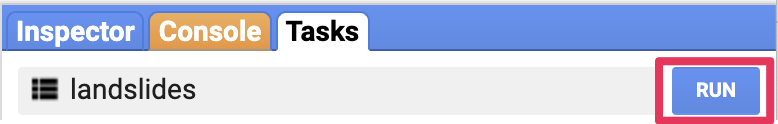
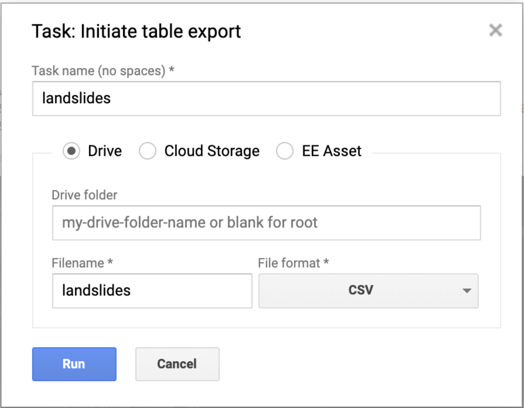
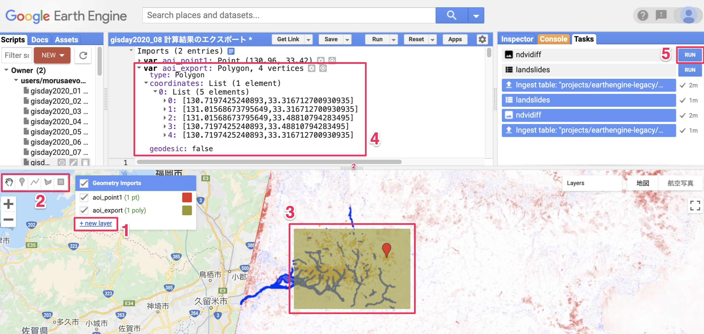

# 計算結果のエクスポート

<!-- TOC depthFrom:1 depthTo:6 withLinks:1 updateOnSave:1 orderedList:0 -->

- [計算結果のエクスポート](#計算結果のエクスポート)
	- [エクスポートの概要](#エクスポートの概要)
	- [フィーチャコレクション（ベクタ型データ）のエクスポート](#フィーチャコレクション（ベクタ型データ）のエクスポート)
	- [イメージ（ラスタ型データ）のエクスポート](#イメージ（ラスタ型データ）のエクスポート)
	- [プログラム全体](#プログラム全体)

<!-- /TOC -->

## エクスポートの概要

計算結果や集計結果はエクスポートして外部のソフトウエアで利用可能です．
エクスポート先はGoogleドライブの他にアセットも指定できるので，他のスクリプトからも利用することができます．

ここでは，フィーチャコレクション（ベクタ型データ）である`landslides`と，
画像（ラスタ型データ）である`ndvidiff`をGoogleドライブにエクスポートします．

## フィーチャコレクション（ベクタ型データ）のエクスポート

フィーチャコレクションをGoogleドライブにエクスポートするには`Export.table.toDrive`を使用します．
`Export.table.toDrive`の引数は，第一引数としてエクスポート対象のフィーチャコレクション（`landslides`），第二引数としてエクスポートするときのファイル名（`landslides`），第三引数としてエクスポートする型式（`CSV`）です．

エクスポート型式には属性テーブルのみをCSV型式で出力する`CSV`，
ベクタ型データとして出力する`GeoJSON`，`KML`，`KMZ`，`SHP`などがあります．


```javascript
Export.table.toDrive({
  collection: landslides,
  description:'landslides',
  fileFormat: 'CSV'
});
```

データのエクスポートはスクリプトが実行されてもエクスポートはされません．
タスクにエクスポートがキューされるだけです．
Googleドライブへ保存するには，タスクペインからキューを実行する必要があります．



キューを実行するとダイアログが出てエクスポートの詳細を指定できます．
Runを押してエクスポートして下さい．
エクスポートが完了するまで数分かかります．
エクスポート終了後はGoogleドライブにアクセスしてダウンロードして下さい．



## イメージ（ラスタ型データ）のエクスポート

イメージのエクスポートはファイルサイズが大きくなるため出力範囲を指定することをおすすめします．

出力範囲はマップ画面の描画ツールを使います．
まず新しいレイヤーを作成します（1）．
次に描画ツールでエクスポートしたい範囲を指定します（2，3）．
エディタペインの上部に指定した範囲がインポートされるので，オブジェクト名を適当に変更します（ここでは`aoi_export`にしました）．



画像をエクスポートするには`Export.image.toDrive`を使います．
第一引数はエクスポートしたいイメージ名（`ndvidiff`），
第二引数に保存するファイル名（`ndvidiff`),
第三引数にエクスポート時の解像度（デフォルトでは1000mになるので，ここでは`30`mにしました），
第四引数にエクスポートする範囲（`aoi_export`）です．

```javascript
Export.image.toDrive({
  image: ndvidiff,
  description: 'ndvidiff',
  scale: 30,
  region: aoi_export
});
```

これもスクリプトの実行のみではエクスポートされないので，
タスクペインからキューを実行します．
これでGoogleドライブにGeoTIFF型式でエクスポートされます．

画像のエクスポートは範囲の広さと解像度次第でファイルサイズが巨大になるため注意が必要です．
ファイルサイズが巨大になるときには分割されて出力されます．

## プログラム全体

```javascript
var start1 = ee.Date('2016-07-01');
var end1 = ee.Date('2017-07-04');

var start2 = ee.Date('2017-07-07');
var end2 = ee.Date('2018-07-04');

var lon = 132;
var lat = 33;
var point = ee.Geometry.Point(lon, lat);

var landslides = ee.FeatureCollection("users/morusaevo9/20170810asakura_toho_handokuzu")
  .filter(ee.Filter.inList('name', ['土砂崩壊地', '洪水流到達範囲']));

var ImageCollection1 = ee.ImageCollection('LANDSAT/LC08/C01/T1_SR')
    .filterDate(start1, end1)
    .filter(ee.Filter.eq('WRS_PATH', 112))
    .filter(ee.Filter.eq('WRS_ROW', 37));

var ImageCollection2 = ee.ImageCollection('LANDSAT/LC08/C01/T1_SR')
    .filterDate(start2, end2)
    .filter(ee.Filter.eq('WRS_PATH', 112))
    .filter(ee.Filter.eq('WRS_ROW', 37));

var aw3d30 = ee.Image("JAXA/ALOS/AW3D30/V2_2");
var elevation = aw3d30.select('AVE_DSM');
var slope = ee.Terrain.slope(elevation);

var addNDVI = function(image) {
  var ndvi = image.normalizedDifference(['B5', 'B4']).rename('NDVI');
  return image.addBands(ndvi);
};

var withNDVI1 = ImageCollection1.map(addNDVI);
var withNDVI2 = ImageCollection2.map(addNDVI);

var ndvimax1 = withNDVI1.select('NDVI').max();
var ndvimax2 = withNDVI2.select('NDVI').max();
var ndvidiff = ndvimax1.subtract(ndvimax2);

var landslides = ndvidiff.reduceRegions({
  collection: landslides,
  reducer: ee.Reducer.mean(),
  scale: 30,
});
var landslides = landslides.map(function(feature){
  return feature.set({ndvimean: feature.get('mean')});
});

var landslides = slope.reduceRegions({
  collection: landslides,
  reducer: ee.Reducer.mean(),
  scale: 30,
});
var landslides = landslides.map(function(feature){
  return feature.set({slopemean: feature.get('mean')});
});

print('landslides', landslides);

Map.setCenter(lon, lat, 10);

var ndviparam = {
  min: -1,
  max: 1,
  palette: ['blue', 'white', 'green']
};

var diffparam = {
  min: -1,
  max: 1,
  palette: ['blue', 'white', 'red']
};

Map.addLayer(ndvimax1, ndviparam, 'max NDVI before landslides');
Map.addLayer(ndvimax2, ndviparam, 'max NDVI after landslides');
Map.addLayer(ndvidiff, diffparam, 'max NDVI diff');
Map.addLayer(slope, {}, 'slope');
Map.addLayer(landslides.filter(ee.Filter.eq('name', '土砂崩壊地')), {color: 'orange'}, '土砂崩壊地');
Map.addLayer(landslides.filter(ee.Filter.eq('name', '洪水流到達範囲')), {color: 'blue'}, '洪水流到達範囲');

var chart = ui.Chart.feature.groups(
    landslides, 'ndvimean', 'slopemean', 'name'
  )
  .setChartType('ScatterChart')
  .setOptions({
    vAxis: {title: 'Average Slope Angle (deg)'},
    hAxis: {title: 'Average difference of Maximum NDVI'},
  });
print(chart);

var ImageCollection_all = ee.ImageCollection('LANDSAT/LC08/C01/T1_SR')
    .filterDate(start1, end2)
    .filter(ee.Filter.eq('WRS_PATH', 112))
    .filter(ee.Filter.eq('WRS_ROW', 37));

var withNDVI_all = ImageCollection_all.map(addNDVI);

var chart = ui.Chart.image.series(
  withNDVI_all.select('NDVI'),
  aoi_point1.buffer(100),
  ee.Reducer.mean(),
  30)
    .setOptions({
        vAxis: {title: 'mean NDVI'},
        hAxis: {title: 'Date'},
    });

print(chart);

Export.table.toDrive({
  collection: landslides,
  description:'landslides',
  fileFormat: 'CSV'
});

Export.image.toDrive({
  image: ndvidiff,
  description: 'ndvidiff',
  scale: 30,
  region: aoi_export
});
```
